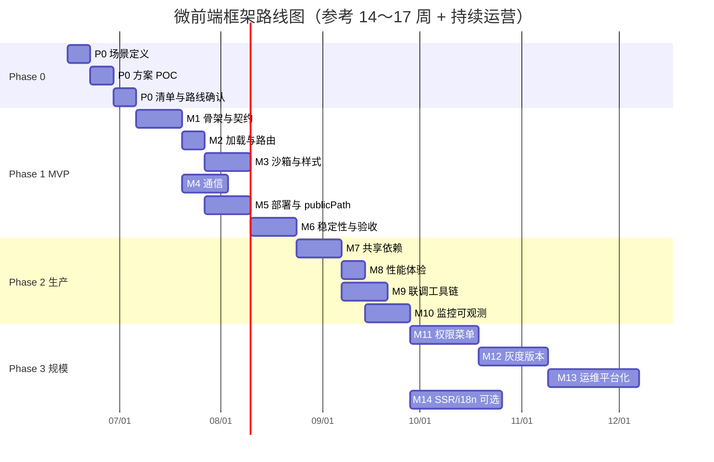

# 微前端框架路线图与里程碑

> 本文档基于 [微前端框架必备特性](./微前端框架必备特性.md) 制定，将必备特性、增强特性拆解为可执行的阶段目标与验收里程碑，用于指导探索、POC、自研或深度封装工作。
>
> **建议周期：** 以下为参考工期，可按团队规模（1～2 人探索 / 3～5 人专项）压缩或拉长。

---

## 1. 路线图总览

```
Phase 0          Phase 1              Phase 2                 Phase 3
探索选型    →    MVP 可用        →    生产就绪           →    规模化运营
(2～3 周)        (6～8 周)            (4～6 周)               (持续迭代)

├─ 场景定义      ├─ M1 骨架跑通       ├─ M7 工程化闭环        ├─ M11 权限菜单
├─ 方案 POC      ├─ M2 加载与路由     ├─ M8 性能体验          ├─ M12 灰度版本
├─ 选型决策      ├─ M3 隔离能力       ├─ M9 联调工具链        ├─ M13 可观测平台
└─ 测试清单      ├─ M4 通信契约       ├─ M10 监控告警         └─ M14 SSR（可选）
                 ├─ M5 部署路径
                 └─ M6 稳定性 MVP
```

### 阶段与特性映射

| 阶段 | 目标 | 覆盖必备特性（见特性文档 §3） | 覆盖增强特性（见特性文档 §4） |
|------|------|------------------------------|------------------------------|
| **Phase 0** | 明确做什么、用什么做 | — | 选型对比维度（§5） |
| **Phase 1** | 端到端跑通，可演示 | §3.1～§3.10 全部 | — |
| **Phase 2** | 团队日常开发可依赖 | 巩固 §3.7、§3.8 | 共享依赖、预加载、Keep-Alive、联调、可观测性 |
| **Phase 3** | 企业级规模化落地 | 全面巩固 | 权限菜单、灰度、SSR、国际化、弹层协调 |

### 阶段门禁（Go / No-Go）

| 门禁 | 通过条件 | 未通过则 |
|------|----------|----------|
| **G0 → Phase 1** | 场景清晰、技术路线确定、POC 测试清单评审通过 | 继续 POC 或调整范围 |
| **G1 → Phase 2** | M1～M6 全部验收、至少 2 个子应用异构或同构 demo 稳定运行 | 回退修复，不进入生产推广 |
| **G2 → Phase 3** | 至少 1 个业务子应用独立上线、联调与监控可用 | 限定试点范围，不全面推广 |
| **G3 持续运营** | 灰度与版本策略评审通过 | 维持 Phase 2 能力，暂缓规模化 |

---

## 2. Phase 0：探索与选型

**周期：** 2～3 周  
**目标：** 回答「是否需要微前端、用什么方案、MVP 边界在哪」。

### 里程碑 P0-M1：场景与约束定义

| 项 | 内容 |
|----|------|
| **交付物** | 《目标场景说明》— 技术栈、团队结构、部署环境、浏览器兼容矩阵 |
| **关键决策** | 同构 / 异构、是否需 IE、CDN 策略、monorepo / 多仓库 |
| **验收** | [ ] 干系人签字确认场景与约束<br>[ ] 明确「不做」清单（如暂不支持 SSR） |

### 里程碑 P0-M2：候选方案 POC

| 项 | 内容 |
|----|------|
| **交付物** | 2～3 个方案的 POC 仓库 + 《POC 对比报告》 |
| **候选范围** | qiankun、micro-app、wujie、Module Federation、single-spa、ESM Import Maps 等择 2～3 个 |
| **对比维度** | 沿用特性文档 §5：隔离、接入成本、独立部署、性能、调试、浏览器兼容 |
| **验收** | [ ] 每个 POC 完成「主应用 + 2 子应用」最小 demo<br>[ ] 对比报告含打分表与推荐结论 |

### 里程碑 P0-M3：测试清单与路线确认

| 项 | 内容 |
|----|------|
| **交付物** | 《POC 验收测试清单》（源自特性文档 §3 各项验收标准） |
| **验收** | [ ] 测试清单覆盖 §3.1～§3.10<br>[ ] 确定 Phase 1 技术路线：采纳开源 / 二次封装 / 自研 |
| **门禁** | **G0**：通过后进入 Phase 1 |

---

## 3. Phase 1：MVP 可用

**周期：** 6～8 周  
**目标：** 实现特性文档 §3 全部必备特性，完成可演示、可交接的最小框架。

---

### 里程碑 M1：主应用骨架与子应用契约

**对应特性：** §3.1 生命周期、§3.10 统一接入规范  
**周期：** 第 1～2 周

| 交付物 | 说明 |
|--------|------|
| 主应用（Shell）工程模板 | 含注册 API、容器挂载点、启动流程 |
| 子应用接入模板 / CLI 脚手架 | 导出 `bootstrap` / `mount` / `unmount` |
| 契约文档 v0.1 | props 字段、`container`、`basename` 等 |

**任务清单：**

- [ ] 实现 `register(apps)` 与 `start()` 启动编排
- [ ] 子应用 lifecycle 调用顺序：load → bootstrap → mount → unmount
- [ ] 定义 props 类型（TypeScript 类型包或 `.d.ts`）
- [ ] 子应用支持「独立运行」模式（无基座时可本地 dev）

**验收标准（源自 §3.1、§3.10）：**

- [ ] 不刷新页面可切换子应用
- [ ] 重复进入同一路由不重复 bootstrap（或可配置）
- [ ] unmount 后无残留 DOM / 事件监听
- [ ] 新子应用按模板 5 分钟内接入主应用
- [ ] 文档含本地联调步骤

**依赖：** G0 通过  
**风险：** 契约设计过早固化 → 预留 `props` 扩展字段与版本号

---

### 里程碑 M2：动态加载与路由激活

**对应特性：** §3.2 动态加载、§3.3 路由分发  
**周期：** 第 2～3 周

| 交付物 | 说明 |
|--------|------|
| Loader 模块 | HTML Entry 或 JS Entry（与 Phase 0 选型一致） |
| 路由激活模块 | `activeRule`：path / 正则 / 函数 |
| Loading 与 404 页 | 加载中 UI、未匹配兜底 |

**任务清单：**

- [ ] 按路由按需拉取子应用 JS / CSS
- [ ] 支持 `history` 模式（`hash` 可作为可选项）
- [ ] 主应用路由 ↔ 子应用内部路由协同（`basename` 传递）
- [ ] 浏览器前进 / 后退行为正确

**验收标准（源自 §3.2、§3.3）：**

- [ ] 首次访问子应用路由时才加载其资源
- [ ] 子应用部署更新后，主应用无需发版即可加载新版本
- [ ] 刷新后仍处于正确子应用与页面
- [ ] 同一容器不会意外挂载多个子应用

**依赖：** M1  
**风险：** HTML Entry 路径解析错误 → 与 M5 publicPath 联调提前对齐

---

### 里程碑 M3：JS 沙箱与样式隔离

**对应特性：** §3.4 JS 隔离、§3.5 样式隔离  
**周期：** 第 3～5 周

| 交付物 | 说明 |
|--------|------|
| Sandbox 实现 | Snapshot 或 Proxy（与选型一致） |
| Style 隔离实现 | Scoped CSS 或 Shadow DOM 等 |
| 沙箱白名单配置 | 第三方 SDK 豁免机制 |

**任务清单：**

- [ ] 子应用运行时隔离 `window` 可变全局属性
- [ ] unmount 时恢复全局状态、移除注入样式
- [ ] 处理弹层 / Portal 的样式边界（文档记录限制）
- [ ] 编写隔离相关边界 case 测试（相同 class 名、全局样式重置）

**验收标准（源自 §3.4、§3.5）：**

- [ ] 子应用 A 修改 `window.xxx` 不影响子应用 B
- [ ] 卸载后全局状态可恢复
- [ ] 两子应用相同 class 名不串样式
- [ ] 切换子应用后无残留 `<style>` / `<link>`
- [ ] 第三方 SDK 限制或白名单有文档说明

**依赖：** M2  
**风险：** Proxy 沙箱与旧 SDK 冲突 → 尽早用真实业务脚本验证

---

### 里程碑 M4：跨应用通信

**对应特性：** §3.6 跨应用通信  
**周期：** 第 4～5 周

| 交付物 | 说明 |
|--------|------|
| 全局状态 API | `setGlobalState` / `onGlobalStateChange` |
| 事件总线（可选） | `emit` / `on` / `off` |
| 通信最佳实践文档 | 状态归属、反模式（§7） |

**任务清单：**

- [ ] mount props 下发用户信息、配置
- [ ] 子 → 主回调通道
- [ ] 登录态变更后各子应用同步验证 demo
- [ ] 子应用独立运行时 mock 全局状态

**验收标准（源自 §3.6）：**

- [ ] 登录态变更后所有已挂载子应用同步
- [ ] 通信 API 有 TypeScript 类型
- [ ] 子应用脱离主应用可独立开发调试

**依赖：** M1（可与 M3 并行）  
**风险：** 过度共享状态 → 文档明确 Source of Truth 与单向数据流

---

### 里程碑 M5：独立构建、部署与 publicPath

**对应特性：** §3.7 独立部署、§3.8 publicPath  
**周期：** 第 5～6 周

| 交付物 | 说明 |
|--------|------|
| Monorepo 或多仓库示例 | 主应用 + ≥2 子应用独立构建 |
| CI/CD 示例流水线 | 子应用单独 build & deploy |
| 多环境配置说明 | dev / staging / prod 入口 URL |

**任务清单：**

- [ ] 子应用独立 `build`，产物部署到 CDN 子路径
- [ ] 运行时 `publicPath` / `__webpack_public_path__` 或等价机制
- [ ] 异步 chunk、静态资源路径验证
- [ ] 主应用通过配置（JSON / 远程 manifest）关联子应用入口

**验收标准（源自 §3.7、§3.8）：**

- [ ] 子应用 A 发布不影响子应用 B 构建
- [ ] 主应用仅改配置即可指向新入口
- [ ] 部署在 `https://cdn.example.com/app-a/v1.2.3/` 资源无 404
- [ ] 懒加载 chunk 路径正确
- [ ] dev / prod 路径策略有文档

**依赖：** M2  
**风险：** 刷新 404（服务端路由未配置）→ 与运维对齐 Nginx / CDN 回退规则

---

### 里程碑 M6：错误隔离与 MVP 集成验收

**对应特性：** §3.9 错误隔离与降级  
**周期：** 第 6～8 周

| 交付物 | 说明 |
|--------|------|
| 错误边界组件 | 加载失败 UI、重试、运行时 Error Boundary |
| 超时与降级策略 | 加载超时配置 |
| MVP 集成 Demo | 主应用 + 2 子应用端到端演示 |
| Phase 1 验收报告 | 对照 §3 全量 checklist |

**任务清单：**

- [ ] 子应用加载失败不阻塞主应用导航
- [ ] 运行时 JS 异常可捕获并展示占位
- [ ] 预留监控上报接口（可先 `console` / 回调）
- [ ] 组织 Phase 1 演示与验收评审

**验收标准（源自 §3.9）：**

- [ ] 子应用 JS 报错时主应用导航仍可用
- [ ] 用户可从不健康子应用切回其他模块
- [ ] 错误可上报（接口或 hook 就绪）
- [ ] **§3.1～§3.10 全部 checklist 通过**

**依赖：** M1～M5  
**门禁：** **G1** — 通过后进入 Phase 2

---

## 4. Phase 2：生产就绪

**周期：** 4～6 周  
**目标：** 满足日常多人协作开发、上线、运维需求，对应特性文档 §4 高优先级增强项。

---

### 里程碑 M7：共享依赖与工程化闭环

**对应增强：** 共享依赖、TypeScript 类型共享、版本兼容策略  
**周期：** 第 1～2 周

| 交付物 | 说明 |
|--------|------|
| 共享依赖策略 | Module Federation `shared` / externals 或 pnpm catalog |
| `@org/micro-fe-types` 包 | 契约与全局状态类型 |
| 兼容矩阵文档 | 主应用与子应用最低版本 |

**验收：**

- [ ] 页面无 React / Vue 多实例警告
- [ ] 类型包被主应用与子应用引用
- [ ] 子应用升级有兼容性说明

---

### 里程碑 M8：性能体验优化

**对应增强：** 预加载、Keep-Alive  
**周期：** 第 2～3 周

| 交付物 | 说明 |
|--------|------|
| 预加载策略 | `prefetch` / `requestIdleCallback` / 路由悬停预加载 |
| Keep-Alive 缓存 | 切换 Tab 保留子应用状态（可选配） |
| 性能基线报告 | 首屏、切换耗时、内存占用 |

**验收：**

- [ ] 高频子应用二次进入耗时显著降低
- [ ] Keep-Alive 开关可配置，unmount 清理仍可控
- [ ] 有性能对比数据（优化前 / 后）

---

### 里程碑 M9：开发联调工具链

**对应增强：** 开发联调模式  
**周期：** 第 3～4 周

| 交付物 | 说明 |
|--------|------|
| 本地联调指南 | 主 dev + 子 dev 同时热更新 |
| 环境切换配置 | 本地子应用 / 远程子应用混合调试 |
| 可选：CLI `link` / 代理脚本 | 降低联调配置成本 |

**验收：**

- [ ] 主应用 localhost 可加载子应用 localhost 入口
- [ ] 子应用热更新不破坏沙箱与路由
- [ ] 新人按文档 30 分钟内完成联调环境搭建

---

### 里程碑 M10：监控与可观测性

**对应增强：** 可观测性  
**周期：** 第 4～6 周

| 交付物 | 说明 |
|--------|------|
| 埋点 / 监控接入 | Sentry、自研埋点等至少一种 |
| 关键指标看板 | 加载成功率、耗时、子应用错误率 |
| 告警规则建议 | 加载失败率超阈值 |

**验收：**

- [ ] 子应用加载失败、运行时错误可在平台查看
- [ ] 可按子应用维度筛选指标
- [ ] 至少 1 个真实业务子应用接入监控

**依赖：** M6  
**门禁：** **G2** — 通过后进入 Phase 3 试点推广

---

## 5. Phase 3：规模化运营

**周期：** 持续迭代（按业务节奏排期）  
**目标：** 企业级平台化能力，支撑多团队、多环境、多版本并行。

---

### 里程碑 M11：权限与菜单一体化

**对应增强：** 权限与菜单集成、弹层/遮罩协调  
**建议周期：** 3～4 周

| 交付物 | 说明 |
|--------|------|
| 动态菜单注册 | 按权限过滤子应用与菜单项 |
| 统一布局壳 | 顶栏 / 侧栏由主应用托管 |
| 弹层规范 | 全局 z-index、Modal 挂载点约定 |

**验收：**

- [ ] 无权限子应用不可见且路由不可达
- [ ] 菜单与子应用路由一致
- [ ] 跨应用弹层无遮挡异常

---

### 里程碑 M12：灰度发布与版本管理

**对应增强：** 版本兼容策略（进阶）、§3.7 灰度  
**建议周期：** 3～4 周

| 交付物 | 说明 |
|--------|------|
| 子应用版本 manifest | 远程配置中心或 CDN 版本清单 |
| 灰度策略 | 按用户 / 租户 / 百分比分配版本 |
| 回滚流程 | 一键切回上一稳定版本 |

**验收：**

- [ ] 同一子应用可并行存在两个版本
- [ ] 灰度切换无需主应用发版
- [ ] 回滚演练通过

---

### 里程碑 M13：可观测与运维平台化

**建议周期：** 持续

| 交付物 | 说明 |
|--------|------|
| 子应用健康度仪表盘 | 加载、错误、性能趋势 |
| SLA 与 On-call 手册 | 故障定位路径 |
| 运营报表 | 各子应用访问量、版本分布 |

**验收：**

- [ ] 运维可按子应用快速定位故障
- [ ] 版本分布可视化

---

### 里程碑 M14：SSR / 国际化（可选）

**对应增强：** SSR/SSG、国际化协调、主题共享  
**建议周期：** 按业务需要单独立项

| 交付物 | 说明 |
|--------|------|
| SSR 方案设计或 POC | 仅 SEO / 首屏敏感场景 |
| i18n 同步机制 | 语言切换跨子应用 |
| Design Token 共享 | 跨应用主题一致 |

**验收：** 按立项时定义的子目标验收  
**说明：** 非所有团队必需，建议在 G2 后按业务价值单独评审，不阻塞 G3。

**门禁：** **G3** — M11、M12 通过后全面推广；M14 为加分项

---

## 6. 里程碑时间线（甘特示意）



> 起止日期仅为示意，项目启动时请以实际 kickoff 日重排。

---

## 7. 各阶段交付物清单

| 阶段 | 核心交付物 |
|------|------------|
| **Phase 0** | 场景说明、POC 仓库 ×2～3、对比报告、测试清单、技术路线决策记录 |
| **Phase 1** | 框架核心库、主/子应用模板、契约文档、MVP Demo、Phase 1 验收报告 |
| **Phase 2** | 类型包、联调文档、监控接入、性能基线报告 |
| **Phase 3** | 权限菜单方案、灰度 manifest、运维手册、（可选）SSR/i18n 方案 |

---

## 8. 成功指标（KPI）

| 指标 | Phase 1 目标 | Phase 2 目标 | Phase 3 目标 |
|------|-------------|-------------|-------------|
| 子应用接入耗时 | ≤ 1 人日 | ≤ 0.5 人日（模板化） | ≤ 2 小时（脚手架） |
| 子应用独立发布 | 主应用不发版 | 全自动 CI/CD | 灰度 + 回滚 |
| 路由切换耗时（P95） | < 1s | < 500ms（含预加载） | < 300ms |
| 子应用加载成功率 | ≥ 99%（demo 环境） | ≥ 99.5% | ≥ 99.9% |
| 隔离缺陷（生产 bug） | 记录并修复 | 0 起样式/全局污染 P0 | 持续监控 |
| 新人联调上手 | — | ≤ 30 分钟 | ≤ 15 分钟 |

---

## 9. 风险登记册

| 风险 | 影响阶段 | 缓解措施 |
|------|----------|----------|
| 选型反复 | Phase 0～1 | 限时 POC（1 周 / 方案），明确决策人 |
| 沙箱与 SDK 冲突 | M3 | 早期引入真实第三方脚本测试；白名单机制 |
| Portal 样式错乱 | M3 | 单独测试 Modal/Drawer；文档写明限制 |
| 刷新 404 | M2、M5 | 提前与运维对齐服务端 fallback |
| 共享依赖版本冲突 | M7 | 锁定 major 版本；pnpm overrides / MF shared 策略 |
| 全局状态膨胀 | M4 | Code Review 检查；通信规范培训 |
| 范围蔓延（SSR 等） | Phase 3 | M14 单独立项，不挤占 MVP 资源 |

---

## 10. 与特性文档的追溯关系

| 里程碑 | 特性文档章节 |
|--------|-------------|
| M1 | §3.1、§3.10 |
| M2 | §3.2、§3.3 |
| M3 | §3.4、§3.5 |
| M4 | §3.6 |
| M5 | §3.7、§3.8 |
| M6 | §3.9 + §3 全量验收 |
| M7～M10 | §4 增强特性 |
| M11～M14 | §4 增强 + §6 Phase 2/3 |
| 全阶段 | §7 反模式作为 Review 检查项 |

---

## 11. 近期行动项（启动后第 1 周）

- [ ] 召开 kickoff，确认 Phase 0 起止日期与负责人
- [ ] 填写《目标场景说明》初稿（浏览器、技术栈、部署）
- [ ] 从 qiankun / MF / micro-app 中选 2 个启动 POC
- [ ] 将特性文档 §3 验收标准复制为《POC 测试清单》初稿
- [ ] 建立本路线图的状态跟踪（Issue / 看板 / 周报）

---

## 12. 文档维护

| 版本 | 日期 | 说明 |
|------|------|------|
| v0.1 | 2026-06-12 | 初版，基于《微前端框架必备特性》§3～§6 编制 |

**维护原则：** 每个阶段门禁评审后更新里程碑状态；技术路线变更时同步修订 Phase 1 任务范围。
